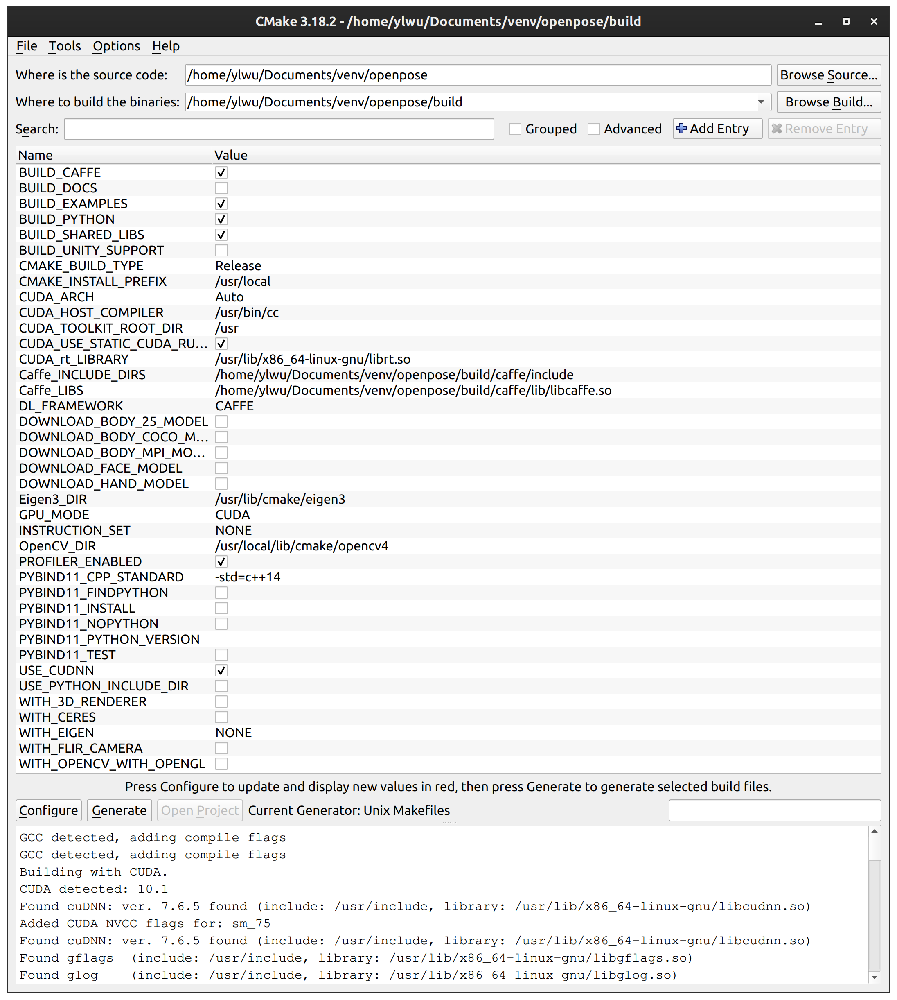

# openpose_installation_guide

This instruction set is based on my experience of installing Openpose on Linux. More information regarding the installation can be referred to [CMU-Perceptual-Computing-Lab's official Github page on Openpose](https://github.com/CMU-Perceptual-Computing-Lab/openpose/blob/master/doc/installation.md#windows-portable-demo).

My setup is as follows:

```
CPU: Intel i5-9400F
RAM: 16GB DDR4 2666MHz
GPU: NVIDIA GeForce RTX 2060 (VRAM 6GB, CUDA core 1920)

Platform: Ubuntu 20.04 LTS x86_64
Kernel: 5.4.0-47-generic
CUDA: 10.1
cuDNN: 7.6.5
gcc/g++: 7
```

For your interest, I have tried the following setups before current implementation.

1. Running **without GPU** (i.e. CPU only) results in 0.1 fps.

2. Running **CUDA without cuDNN** results in the following error:
```
Check failed: error == cudaSuccess (2 vs. 0) out of memory
```
If you are running on GPUs with higher VRAM, you can try to free some GPU memory by [this](https://stackoverflow.com/questions/40090892/check-failed-error-cudasuccess-2-vs-0-out-of-memory). But it did not work for me.

## Clone the repository

Clone the repository as follows:

```
git clone https://github.com/CMU-Perceptual-Computing-Lab/openpose
git pull origin master
git submodule update --init --recursive --remote
``` 

## Prerequisites

Follow the instructions [here](https://github.com/CMU-Perceptual-Computing-Lab/openpose/blob/master/doc/prerequisites.md) and setup **Ubuntu Prerequisites** 2, 3, and 5 accordingly.

2. Run accordingly, no issues should be encountered.

3. Check CUDA version with `nvcc -V` and download corresponding supported version of cuDNN from [NVIDIA cuDNN](https://developer.nvidia.com/cudnn) official website. 
Following is an exmplae for my case (cvDNN v7.6.5 for CUDA 10.1):

Download **cuDNN Runtime Library for Ubuntu18.04 (Deb)** and **cuDNN Developer Library for Ubuntu18.04 (Deb)** and run the `.deb` files.

Download **cuDNN Library for Linux**. Unzip the `.tar` file to `/usr/local/cuda`.

```
sudo tar -xzf cudnn-10.1-linux-x64-v7.6.5.32.tgz -C /usr/local/
sudo chmod a+r /usr/local/cuda/include/cudnn*.h /usr/local/cuda/lib64/libcudnn*
```

In `~/.bashrc`, add the following lines at the end of file:
```
export CUDA_HOME=/usr/local/cuda
export LD_LIBRARY_PATH=/usr/local/cuda/lib64:$LD_LIBRARY_PATH
export PATH=/usr/local/cuda/bin:$PATH
```
Finally, run `source ~/.bashrc` in terminal.

This step is important because the supported gcc/g++ version differ depending on your CUDA version.

5. Run accordingly, no issues should be encountered.

## Installing gcc
As pointed out, **CUDA 10.1** supports gcc/g++ <=8, whereas the default gcc/g++ that comes with Ubuntu 20 is **gcc-9**. We need to fix that.

```
sudo apt-get install gcc-7 g++-7
sudo ln -s /usr/bin/gcc-7 /usr/local/cuda/
sudo ln -s /usr/bin/gcc-7 /usr/bin/cc
sudo ln -s /usr/bin/gcc-7 /usr/bin/c++
```
Now, we have made a link to `cc` and `c++` so the system will use `gcc/g++-7` later in installation.


## CMake GUI
In CMake GUI, some columns need to be entered manually. Make sure to check your directory on your own setup before inputting.
My setup is shown as follows:

<p align='center'>
  
</p>

## Installation
Once no error is shown in CMake, run

```
cd build/
make -j`nproc`
```
Make sure the installation completed without error then you are good to go!

## Run sample
As for my setting, I get around 16.5fps and an usage of 3100MiB on GPU.
```
./build/examples/openpose/openpose.bin --video examples/media/video.avi
```

## References
https://github.com/CMU-Perceptual-Computing-Lab/openpose#installation-reinstallation-and-uninstallation

https://docs.nvidia.com/deeplearning/cudnn/install-guide/index.html

https://gist.github.com/ax3l/9489132